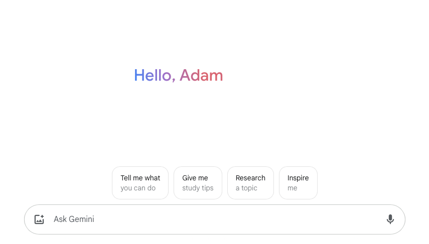
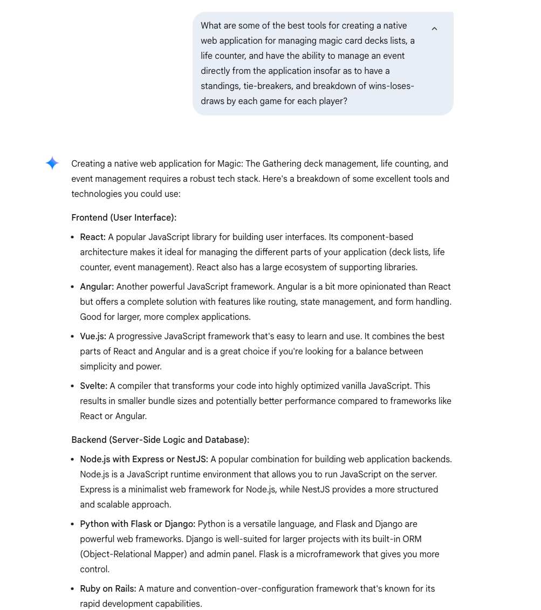
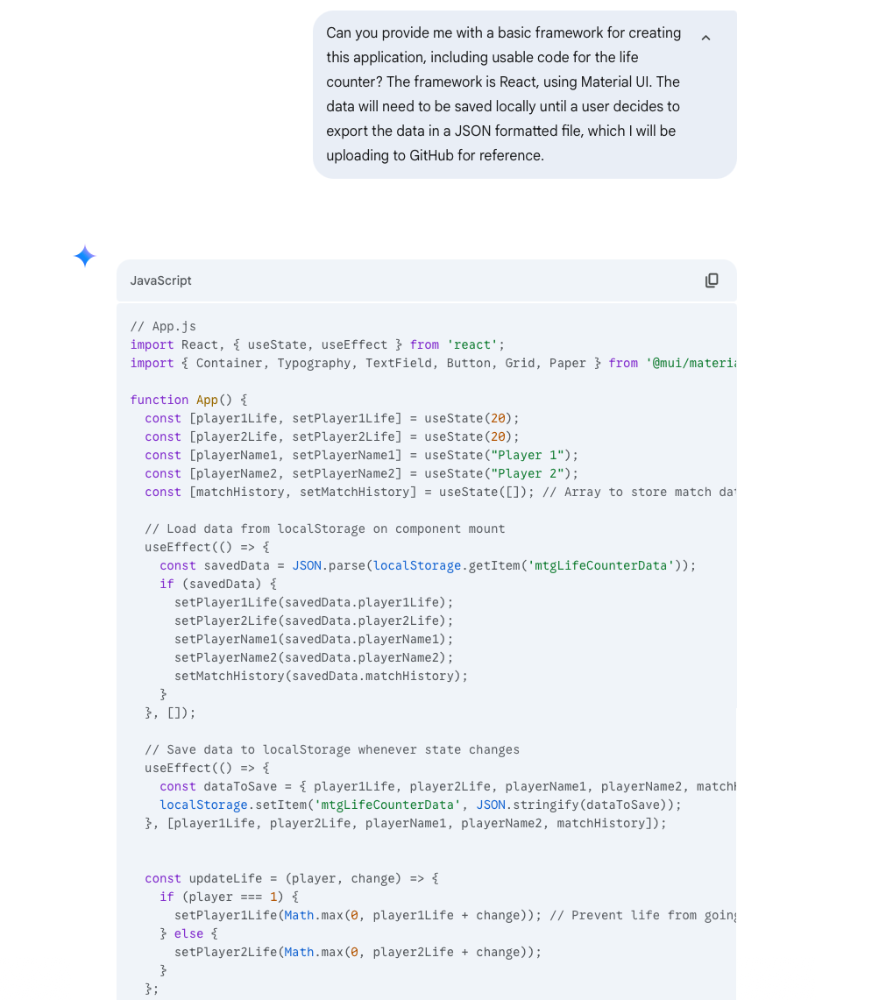
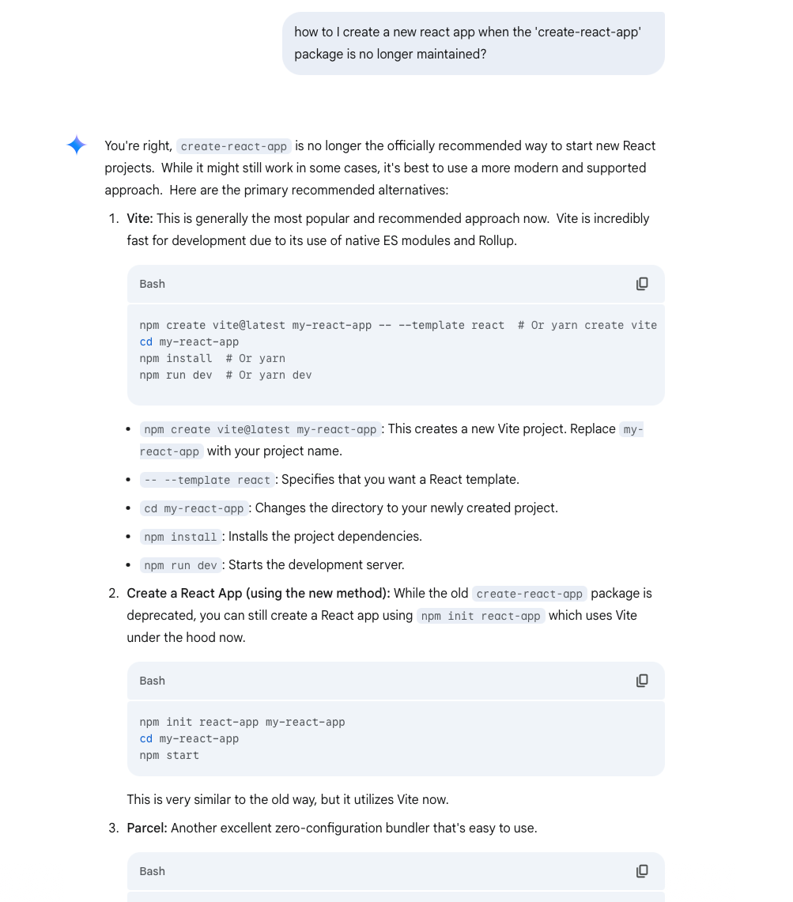
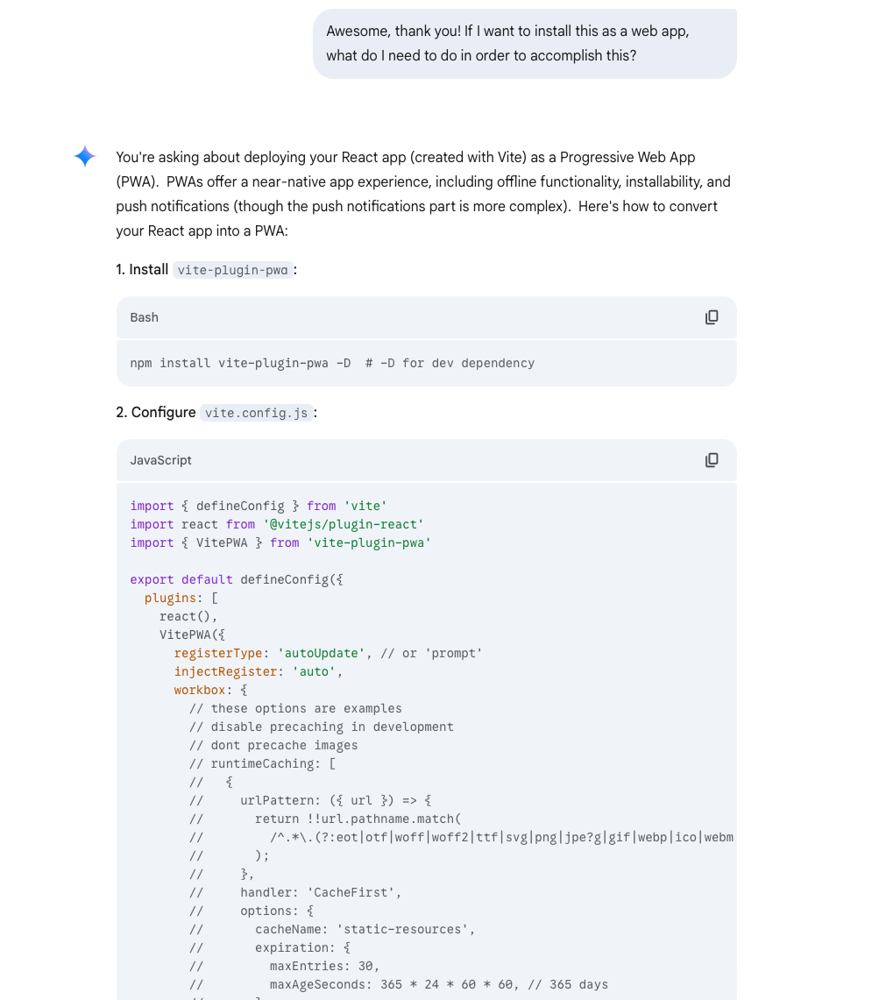
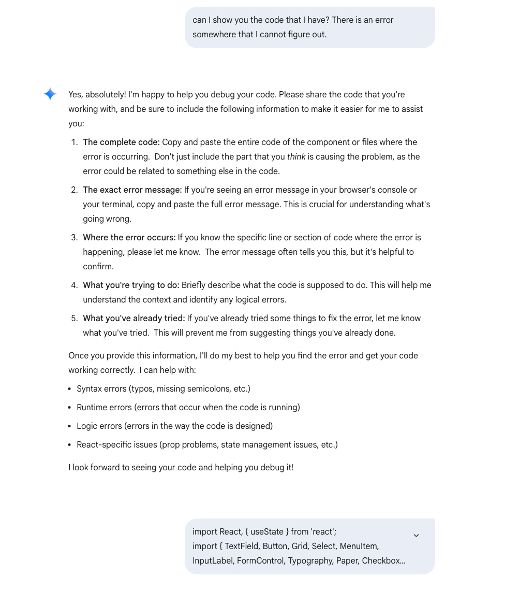
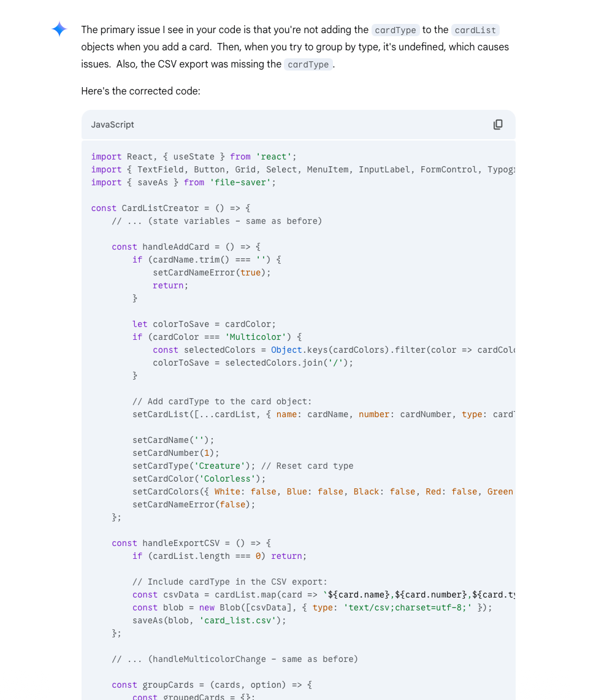
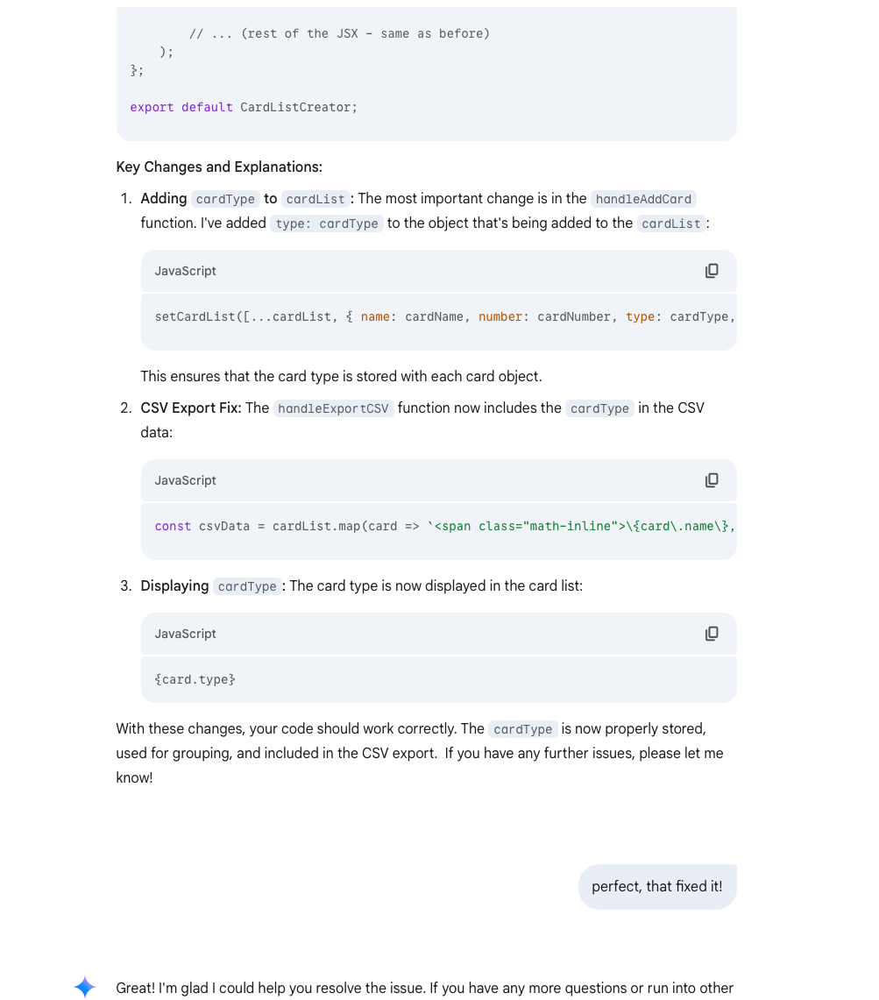
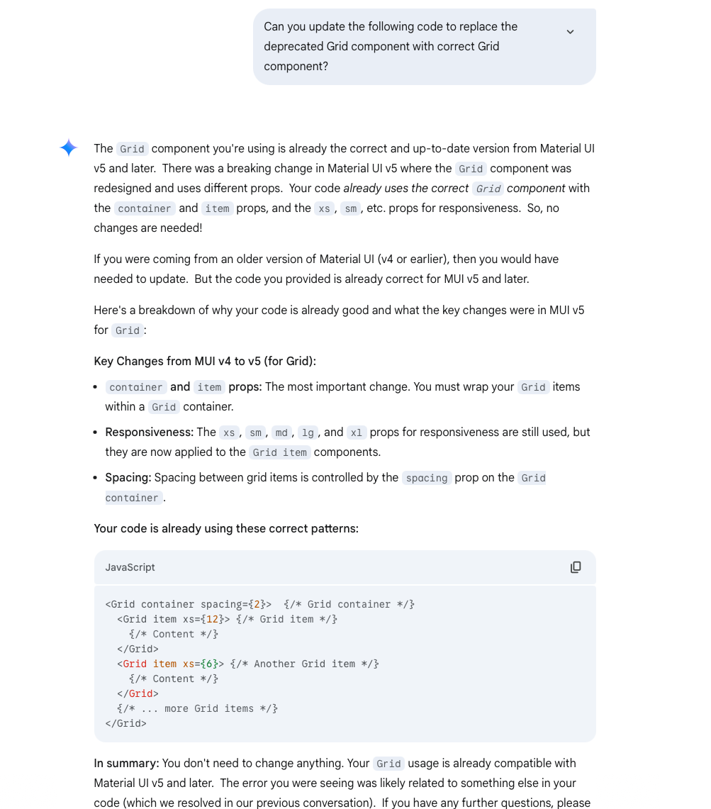
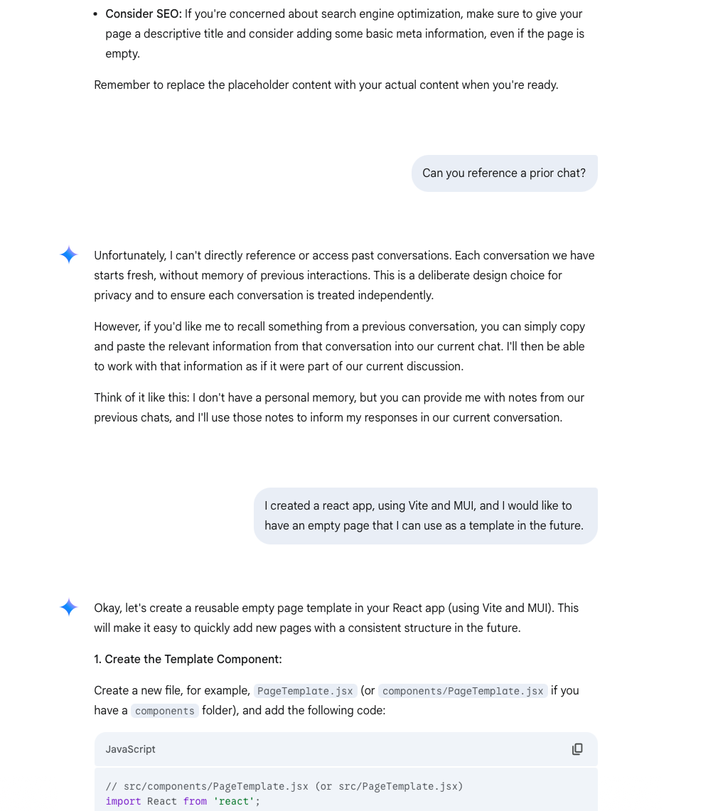

It all began with this prompt:

> What are some of the best tools for creating a native web application for managing magic card decks lists, a life counter, and have the ability to manage an event directly from the application insofar as to have a standings, tie-breakers, and breakdown of wins-loses-draws by each game for each player?

<!-- truncate -->

From this initial prompt, I began the two-day process of creating my first web app using AI.

## AI Choice

For this, I decided to try out Gemini, as I had tried ChatGPT and Claude AI previously but was not too impressed with the results. I don't know if this was due to my prompts or the models, but it was enough to get me to try another system.



## The Prompts And Returns

> What are some of the best tools for creating a native web application for managing magic card decks lists, a life counter, and have the ability to manage an event directly from the application insofar as to have a standings, tie-breakers, and breakdown of wins-loses-draws by each game for each player?



This was my initial prompt, as I have wanted to create a new system for managing my local games and never really liked the way that I had to use multiple apps to handle matches, standings, and deck lists.

Gemini responded with a variety of frontend, backend, database, and state management solutions, with an example tech stack of the following:

- Frontend: React, Material UI, Redux
- Backend: Node.js, Express, PostgreSQL
- Database: PostgreSQL
- Hosting: Netlify (for frontend), AWS or Google Cloud (for backend and database)

From this example tech stack, I followed up with this prompt:

> Can you provide me with a basic framework for creating this application, including usable code for the life counter? The framework is React, using Material UI. The data will need to be saved locally until a user decides to export the data in a JSON formatted file, which I will be uploading to GitHub for reference.



**Below is `App.js` code provided by Gemini**

```javascript
// App.js
import React, { useState, useEffect } from 'react';
import { Container, Typography, TextField, Button, Grid, Paper } from '@mui/material';

function App() {
  const [player1Life, setPlayer1Life] = useState(20);
  const [player2Life, setPlayer2Life] = useState(20);
  const [playerName1, setPlayerName1] = useState("Player 1");
  const [playerName2, setPlayerName2] = useState("Player 2");
  const [matchHistory, setMatchHistory] = useState([]); // Array to store match data

  // Load data from localStorage on component mount
  useEffect(() => {
    const savedData = JSON.parse(localStorage.getItem('mtgLifeCounterData'));
    if (savedData) {
      setPlayer1Life(savedData.player1Life);
      setPlayer2Life(savedData.player2Life);
      setPlayerName1(savedData.playerName1);
      setPlayerName2(savedData.playerName2);
      setMatchHistory(savedData.matchHistory);
    }
  }, []);

  // Save data to localStorage whenever state changes
  useEffect(() => {
    const dataToSave = { player1Life, player2Life, playerName1, playerName2, matchHistory };
    localStorage.setItem('mtgLifeCounterData', JSON.stringify(dataToSave));
  }, [player1Life, player2Life, playerName1, playerName2, matchHistory]);


  const updateLife = (player, change) => {
    if (player === 1) {
      setPlayer1Life(Math.max(0, player1Life + change)); // Prevent life from going below 0
    } else {
      setPlayer2Life(Math.max(0, player2Life + change));
    }
  };

  const handleMatchEnd = (winner) => {
    const matchData = {
      player1: playerName1,
      player2: playerName2,
      player1Life: player1Life,
      player2Life: player2Life,
      winner: winner,  // Could be 1, 2, or 0 for a draw
      date: new Date().toLocaleDateString(), // Record match date
    };
    setMatchHistory([...matchHistory, matchData]);
    // Reset Life totals for new match
    setPlayer1Life(20);
    setPlayer2Life(20);
  };

  const exportData = () => {
    const dataToExport = { player1Life, player2Life, playerName1, playerName2, matchHistory };
    const jsonString = JSON.stringify(dataToExport, null, 2); // Beautified JSON

    const blob = new Blob([jsonString], { type: 'application/json' });
    const url = URL.createObjectURL(blob);
    const link = document.createElement('a');
    link.href = url;
    link.download = 'mtg_data.json';
    link.click();
    URL.revokeObjectURL(url); // Clean up
  };

  return (
    <Container maxWidth="sm">
      <Paper elevation={3} sx={{ padding: 3, marginTop: 4 }}>
        <Typography variant="h4" align="center" gutterBottom>MTG Life Counter</Typography>

        <Grid container spacing={2}>
          <Grid item xs={12}>
            <TextField label="Player 1 Name" fullWidth value={playerName1} onChange={e => setPlayerName1(e.target.value)} />
          </Grid>
          <Grid item xs={6}>
            <Typography variant="h5">Player 1: {player1Life}</Typography>
            <Button variant="contained" onClick={() => updateLife(1, 1)}>+1</Button>{' '}
            <Button variant="contained" onClick={() => updateLife(1, -1)}>-1</Button>
          </Grid>
          <Grid item xs={12}>
            <TextField label="Player 2 Name" fullWidth value={playerName2} onChange={e => setPlayerName2(e.target.value)} />
          </Grid>
          <Grid item xs={6}>
            <Typography variant="h5">Player 2: {player2Life}</Typography>
            <Button variant="contained" onClick={() => updateLife(2, 1)}>+1</Button>{' '}
            <Button variant="contained" onClick={() => updateLife(2, -1)}>-1</Button>
          </Grid>

          <Grid item xs={12}>
            <Button variant="contained" color="primary" onClick={() => handleMatchEnd(1)}>Player 1 Wins</Button>{' '}
            <Button variant="contained" color="secondary" onClick={() => handleMatchEnd(2)}>Player 2 Wins</Button>{' '}
            <Button variant="contained" color="default" onClick={() => handleMatchEnd(0)}>Draw</Button>
          </Grid>

          <Grid item xs={12}>
            <Typography variant="h6">Match History:</Typography>
            {matchHistory.map((match, index) => (
              <div key={index}>
                {match.player1} ({match.player1Life}) vs {match.player2} ({match.player2Life}) - Winner: {match.winner === 1 ? match.player1 : match.winner === 2 ? match.player2 : "Draw"} - {match.date}
              </div>
            ))}
          </Grid>

          <Grid item xs={12}>
            <Button variant="contained" onClick={exportData}>Export Data</Button>
          </Grid>

        </Grid>
      </Paper>
    </Container>
  );
}

export default App;
```

This included explainers on how to use Material UI and why it was chosen, state management uses, handling of the match history (including how to select a winner, life totals, etc.), and methods for exporting the data in the desired JSON format. It even included a breakdown of how to run the code using by first creating a React project, installing Material UI, and replacing the `App.js` file with the one it provided me.

What came next was my first back-and-forth, where I had to explain to Gemini that the suggested `npx create-react-app mtg-life-counter` prompt would not work, as the CreateReactApp project is no longer maintained.



**Me:**
> how to I create a new react app when the 'create-react-app' package is no longer maintained?

**Gemini:**
> You're right, create-react-app is no longer the officially recommended way to start new React projects.  While it might still work in some cases, it's best to use a more modern and supported approach.  Here are the primary recommended alternatives:

- Vite `npm create vite@latest mtg-life-counter`
- Creact a React App (new method) `npm init react-app mtg-life-counter`
- Parcel

I chose to use Vite and ran the suggested command `npm create vite@latest my-mtg-app -- --template react`, installed the dependencies, and started up the development server for the first time. Next came the installation of Material UI.

### Pivot (!)

Here is where I decided to throw in the PWA (Progressive Web App) requirement, testing if it could continue to build off of the prior pieces, using React with Vite.



From there, I asked the following:

- to create this as a multi-page application
- use Material UI for the navigation
- responsive design (material Grid)
- use an `if` option to allow for a secondary dropdown when "multicolor" is selected from the color list
- making fields required
- grouping fields in the "Match Summary" section
  - expanding upon this as a user-choice rather than a fixed option

## Code Questions

Throughout this back-and-forth, I either had questions on why a piece of code was not working or I would ask Gemini to update a piece of code to either replace an existing from Material UI component, or add in a new one somewhere in the code.

### Reference One

**Asking to Fix a Coding Error**

**Gemini provided me with a tidy fixed, with an explanation for each change.**



### Reference Two

I also came across a piece of deprecated code that came from a Gemini response (`<Grid>` vs `<Grid2>`). I asked how to fix this as well:


## Referencing Prior Chats

At some point, I left the chat alone for a while and asked if Gemini could reference a prior chat. Even though I had not left the chat window, nor started a fresh conversation, Gemini was unable to reference what had been discussed previously.



## Findings

After this experiment, I came away quite impressed with what I was able to accomplish with a good set of prompts, research, and trial-and-error. Admittedly, I have some experience with React, but I had always used existing libraries to create anything, riffing off of what came from templates or examples.

Moving forward, I plan to continue to utilize Gemini for updating this web-app and potentially turn it into a native iOS and/or Android app. I'll be testing it at my next Cube event but, if you're interested in it, check out the GitHub repo here: [My MTG App](https://github.com/AdamJ/my-mtg-app).

---

Thanks for reading!
